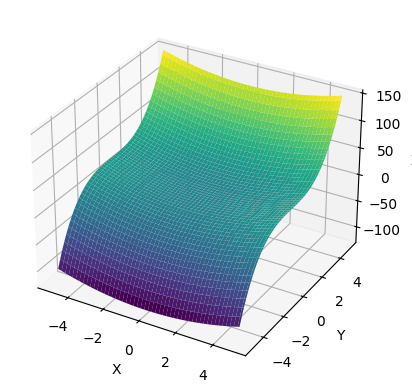

# 三维图像


```python
## 3D 图形
import numpy as np
from mpl_toolkits.mplot3d import Axes3D
import matplotlib.pyplot as plt

# 创建 x 和 y 数据
x = np.linspace(-5, 5, 100)
y = np.linspace(-5, 5, 100)
x, y = np.meshgrid(x, y)

# 计算 z 数据
z = x**2 + y**3

# 创建一个新的图形
fig = plt.figure()
ax = fig.add_subplot(111, projection='3d')

# 绘制三维图
ax.plot_surface(x, y, z, cmap='viridis')

# 设置标签
ax.set_xlabel('X')
ax.set_ylabel('Y')
ax.set_zlabel('Z')

# 显示图形
plt.show()
```

<div style="text-align: center;">
    
</div>


使用  标签可以更简单地将图片居中显示。

```python
